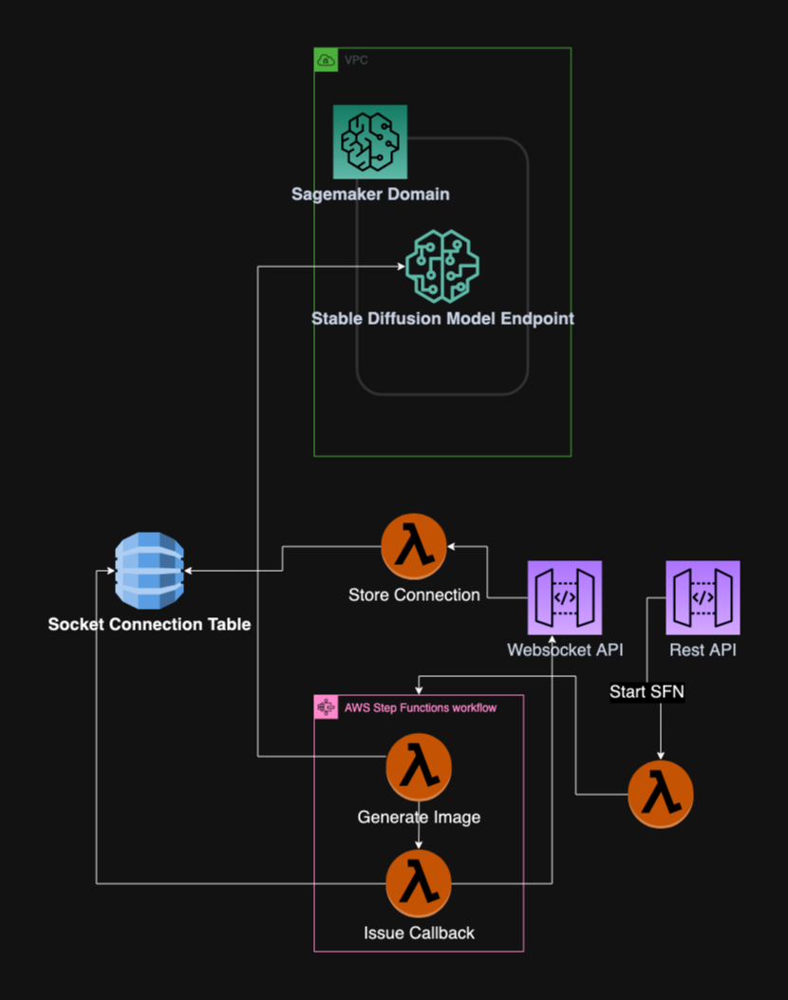

# asynchronous-stable-diffusion-image-management-api

This project contains AWS resources to support the generation of images using an existing Sagemaker Endpoint and API Gateway and AWS Lambda. 

## Prerequisiites

This project assumes that a Sagemaker Endpoint is already running in the target account. To create a stable diffusion endpoint you can [use Sagemaker Jumpstart](https://docs.aws.amazon.com/sagemaker/latest/dg/studio-jumpstart.html#jumpstart-open-use).

## Architecture


## Resources Deployed
- Rest API
  - `POST /generate`: Begins asynchronous workflow for image generation using a prompt strign as the payload.
  - `POST /save`: Saves the codified image data to S3 and stores image metadata in a DynamoDb table.
  - `GET /images`: Retrieves all image data from DynamoDb.
- Websocket API
  - `$default`: Triggers Lambda to store the connection:Step Function execution pair and waits for the callback message containing the image data payload.
- GenerateImageSFN
  - State machine that contains two Lambda Functions. One that calls the Sagemaker Endpoint with the image prompt payload and then passes the image data to a callback function which issues the callback to the websocket API.
- Socket Connections Table
  - DynamoDb table responsible for storing StepFunction Execution ARNs alongside the websocket connection ID for callback.
- Image Data Table:
  - DynamoDb Table responsible for saved image metadata including the object key for later S3 retrieval.
- Image S3 Bucket:
  - S3 Bucket for storing saved images.
- CloudFront CDN:
  - CDN in front of the S3 image bucket.

## Deploy the sample application

The Serverless Application Model Command Line Interface (SAM CLI) is an extension of the AWS CLI that adds functionality for building and testing Lambda applications. It uses Docker to run your functions in an Amazon Linux environment that matches Lambda. It can also emulate your application's build environment and API.

To use the SAM CLI, you need the following tools.

* SAM CLI - [Install the SAM CLI](https://docs.aws.amazon.com/serverless-application-model/latest/developerguide/serverless-sam-cli-install.html)
* [Python 3 installed](https://www.python.org/downloads/)
* Docker - [Install Docker community edition](https://hub.docker.com/search/?type=edition&offering=community)

To build and deploy your application for the first time, run the following in your shell:

```bash
sam build --use-container
sam deploy --guided
```

The first command will build the source of your application. The second command will package and deploy your application to AWS, with a series of prompts:

* **Stack Name**: The name of the stack to deploy to CloudFormation. This should be unique to your account and region, and a good starting point would be something matching your project name.
* **AWS Region**: The AWS region you want to deploy your app to.
* **Confirm changes before deploy**: If set to yes, any change sets will be shown to you before execution for manual review. If set to no, the AWS SAM CLI will automatically deploy application changes.
* **Allow SAM CLI IAM role creation**: Many AWS SAM templates, including this example, create AWS IAM roles required for the AWS Lambda function(s) included to access AWS services. By default, these are scoped down to minimum required permissions. To deploy an AWS CloudFormation stack which creates or modifies IAM roles, the `CAPABILITY_IAM` value for `capabilities` must be provided. If permission isn't provided through this prompt, to deploy this example you must explicitly pass `--capabilities CAPABILITY_IAM` to the `sam deploy` command.
* **Save arguments to samconfig.toml**: If set to yes, your choices will be saved to a configuration file inside the project, so that in the future you can just re-run `sam deploy` without parameters to deploy changes to your application.

You can find your API Gateway Endpoint URL in the output values displayed after deployment.
## Call the API to Generate an Image
See [client.py for an example generation script](client/client.py)
## Cleanup

To delete the sample application that you created, use the AWS CLI. Assuming you used your project name for the stack name, you can run the following:

```bash
sam delete --stack-name image-gpt-api
```

## Resources

See the [AWS SAM developer guide](https://docs.aws.amazon.com/serverless-application-model/latest/developerguide/what-is-sam.html) for an introduction to SAM specification, the SAM CLI, and serverless application concepts.

Next, you can use AWS Serverless Application Repository to deploy ready to use Apps that go beyond hello world samples and learn how authors developed their applications: [AWS Serverless Application Repository main page](https://aws.amazon.com/serverless/serverlessrepo/)


## Security

See [CONTRIBUTING](CONTRIBUTING.md#security-issue-notifications) for more information.

## License

This library is licensed under the MIT-0 License. See the LICENSE file.

